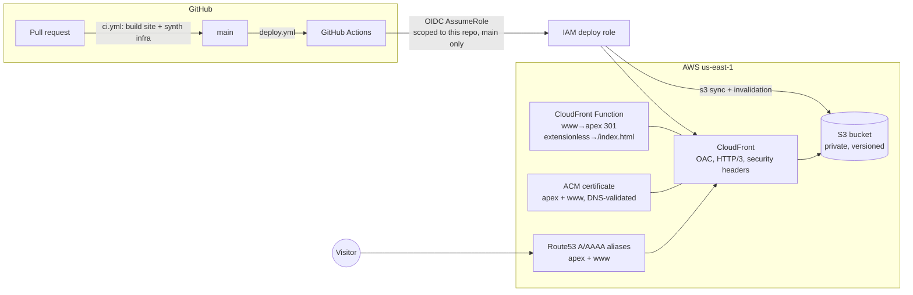

# sometimescreekventures.com

The company site for **Sometimes Creek Ventures LLC** — Sean Denton's cloud & AI
solutions architecture practice. A fully static Astro site served from S3 through
CloudFront, with all infrastructure managed by AWS CDK and deploys authenticated
via GitHub OIDC (no long-lived AWS keys anywhere).

The repo is intentionally public: the infrastructure and pipeline are part of
the portfolio.

## Architecture



Everything lives in a single stack (`ScvSiteStack`) in `us-east-1` — CloudFront
requires its certificate there, so a single-region deployment removes the
cross-region reference problem entirely.

## Repo layout

```
site/    Astro app — static output, Tailwind v4, content collections
infra/   CDK v2 app (TypeScript) — S3, CloudFront, ACM, Route53, OIDC deploy role
.github/ deploy.yml (push to main) and ci.yml (pull requests)
```

## Local development

```bash
cd site
npm ci
npm run dev        # dev server on http://localhost:4321
npm run build      # static build to site/dist
```

The site is a single page plus a 404. All content — stories, stack, ticker,
contact — lives in `site/src/data/site.ts`. The contact email is defined in
exactly one place.

## Infrastructure

The stack is deployed **manually from a workstation** in v1 — CI deploys the
site content only, never the infrastructure.

```bash
cd infra
npm ci
npm test                       # snapshot + assertion tests, no AWS needed
npx cdk synth -q               # also works without credentials

# Authenticate (AWS CLI SSO):
aws sso login
aws sts get-caller-identity    # sanity-check you're in the right account

# First time in the account/region:
npx cdk bootstrap aws://ACCOUNT_ID/us-east-1

# Always diff before deploying:
npx cdk diff
npx cdk deploy
```

The CDK uses the default AWS credential chain, so whatever `aws sts
get-caller-identity` resolves to is what deploys. If you use a named SSO
profile instead, add `--profile <name>` (or export `AWS_PROFILE`) to the
`bootstrap`/`diff`/`deploy` commands.

Assumptions checked at synth/deploy time:

- A Route53 hosted zone for `sometimescreekventures.com` already exists in the
  account (looked up with `HostedZone.fromLookup`).
- If the account already has the GitHub OIDC identity provider
  (`token.actions.githubusercontent.com`), deploy with
  `-c createGithubOidcProvider=false` to import it instead of creating it.
- If Route53 alias records for the apex or `www` already exist (e.g. pointing
  at a previous distribution), `cdk deploy` will fail on the record conflict.
  That is deliberate — resolve the cutover manually rather than force-deleting.

Notes:

- The bucket name is generated, private (Block Public Access), versioned,
  SSE-S3 encrypted, and retained on stack deletion.
- CloudFront reaches the bucket through Origin Access Control; there is no
  S3 website hosting and no public bucket policy.
- `infra/cdk.context.json` pre-seeds the hosted-zone lookup for a placeholder
  account so tests and CI synth run with zero AWS access. Real deploys append
  the real lookup for the real account alongside it.

## Deploys (OIDC, no keys)

`deploy.yml` runs on every push to `main` that touches `site/**`:

1. `npm ci && npm run build` in `site/`
2. `aws-actions/configure-aws-credentials` assumes the deploy role via OIDC.
   The role's trust policy matches exactly
   `repo:sometimescreekventures/sometimescreekventures.com:ref:refs/heads/main`,
   and its permissions are limited to syncing the one bucket and invalidating
   the one distribution.
3. Two-pass `aws s3 sync`: hashed `/_astro/*` assets get
   `public,max-age=31536000,immutable`; HTML and everything else gets
   `no-cache`.
4. `aws cloudfront create-invalidation --paths "/*"`.

Required repository **variables** (not secrets — none of these are sensitive),
taken from the stack outputs after `cdk deploy`:

| Variable | Source |
|---|---|
| `AWS_DEPLOY_ROLE_ARN` | `ScvSiteStack.DeployRoleArn` output |
| `SITE_BUCKET` | `ScvSiteStack.BucketName` output |
| `CF_DISTRIBUTION_ID` | `ScvSiteStack.DistributionId` output |
| `AWS_REGION` | `us-east-1` |

```bash
gh variable set AWS_DEPLOY_ROLE_ARN --body "arn:aws:iam::...:role/scv-site-github-deploy"
gh variable set SITE_BUCKET --body "..."
gh variable set CF_DISTRIBUTION_ID --body "..."
gh variable set AWS_REGION --body "us-east-1"
```

## License

Code is MIT-licensed. Site copy and content are © Sometimes Creek Ventures LLC —
see [LICENSE](LICENSE).
